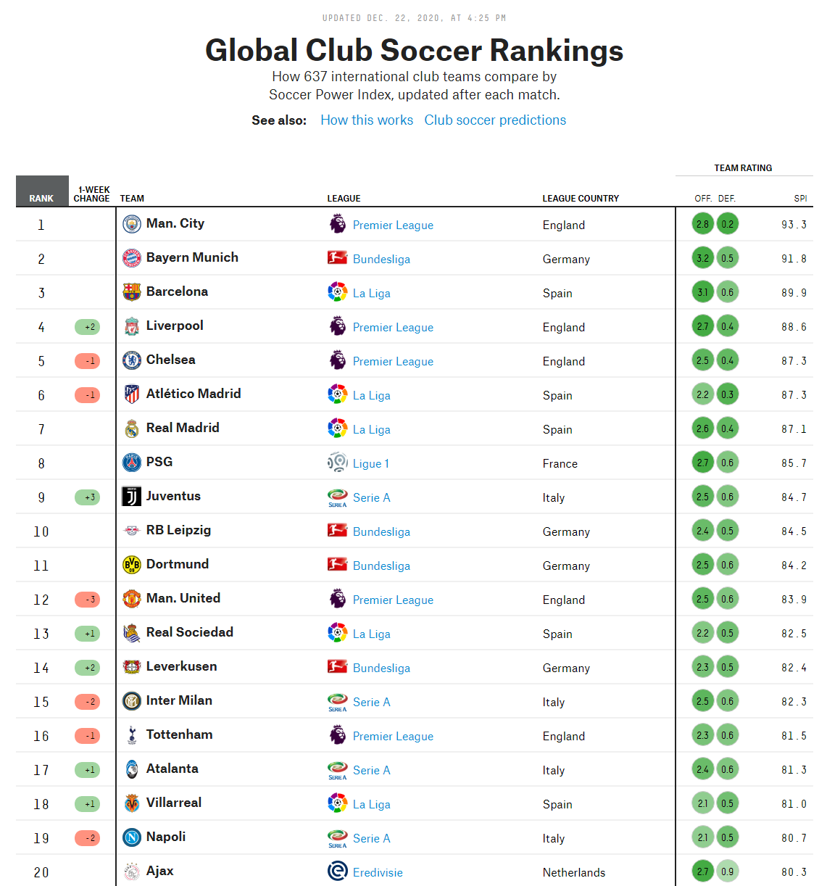

# Machine Learning to Influence Soccer Betting

# Objective
My goal is to predict the outcome of soccer matches in the biggest leagues in the world. The UEFA Champions League, English Premier League, German Bundesliga, and the Spanish La Liga are the main focus. These leagues indicate the highest level of play and viewership in the sport. The sports betting industry as a whole is a multi-hundred-billion dollar behemoth, with soccer taking the top spot. 

# Data

The FiveThirtyEight website hosts years of match history, club SPI(Soccer Performance Index) data and odds. The match data also includes projected scores, relative importance, XG(expected goals), and score. To keep the interface simple, and not overwhelm the user, the model takes only the team SPIs and odds. From those inputs, it calculates the expected winner, and the user can use that information to make an even more educated decision on their betting. 

# Insights

# Results

# Process
1. Data was collected from FiveThirtyEight. 
2. Data was preprocessed and cleaned up in the DataCleaning.ipynb.
3. More EDA and all modeling is in Main.ipynb. 
4. Final Random Forest model was then tuned and pickled to be used to deploy via Streamlit/Heroku. 

# Presentation
Further analysis and slide show can be found here.
